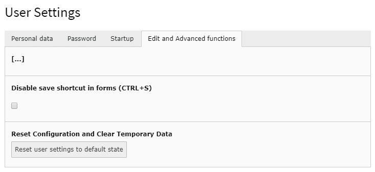

# TYPO3 CMS Extension: Save with shortcut

Adds the possibility to use the keyboard shortcut CTRL+S to save in TYPO3 CMS backend.

## Installation

Just fetch **EXT:save** from TER or Packagist and install it.
Clear the system caches and reload the backend in your browser.

## Usage

Just press ``CTRL+S`` when you want to save the record you are currently working on. Form validation will be triggered
and if successful, the record will be saved.

## Configuration

When **EXT:save** is installed, this feature is globally enabled by default.
You can disable it for your user in your user settings.

## Support

If you like this TYPO3 extension, you can [donate some funds](https://www.paypal.com/cgi-bin/webscr?cmd=_s-xclick&hosted_button_id=2DCCULSKFRZFU) to support further development. Thank you!

For help please visit the [issue section](https://bitbucket.org/t--3/save/issues) on Bitbucket.

## Changelog

### 1.1.0

- **FEATURE** - Add TYPO3 10 support
- **TASK** - Make CTRL+S also work inside of CKeditor
- **TASK** - Improve README

### 1.0.0

- First release
